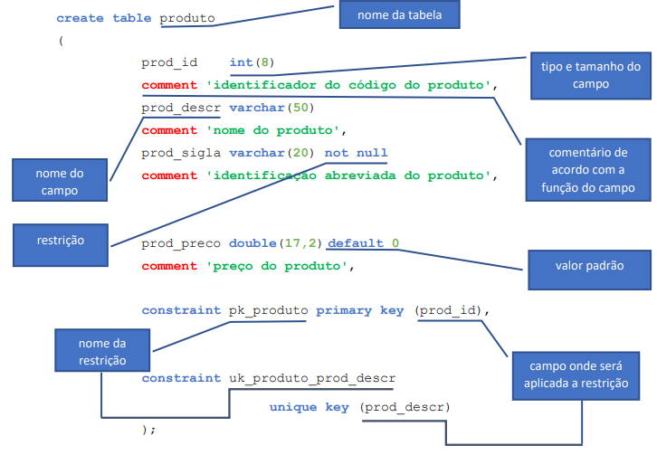

<h2>Estudando MySQL</h2>

Disciplina: Tecnologia da Informação II - ETEC

<h2>Agenda 02: Introdução ao SGBD, implementação de BDs e Interface de Comando.</h2>

## Importante:

Cada uma das etapas a seguir é demonstrada na situação-exemplo indicada [neste arquivo.](./exemplo_escola.md)

## Relembrando...

`SGBD` consiste em um software utilizado para gerir Bases de Dados, permitindo criar, modificar, eliminar tabelas, além de inserir, alterar, excluir e consultar seus dados, tendo como principais características: garantir a segurança e integridade dos dados, seu compartilhamento e a recuperação de falhas (backup).

## Comandos:

### 1. Para criar um banco de dados, utilizar comandos "create database" ou "create schema":

Sintaxe:

~~~sql
create database <nome_do_banco_de_dados>; /* ou */
create schema <nome_do_banco_de_dados>;
~~~

### 2. Para criar tabelas:

Para criação de tabelas, utilizaremos DDL (Data Definition Language, ou Linguagem de Definição de Dados), que possui comandos para
definição e alteração de estruturas do banco de dados. 

Sintaxe:

~~~sql
create table nome_da_tabela (
campo_1 tipo(tamanho) [padrão] [restrição]
[comentário],
 .
 .
 .
campo_n tipo(tamanho) [padrão] [restrição]
[comentário],
[constraint <nome_da_restrição> primary key (<campo(s)_da_tabela)>],
[constraint <nome_da_restrição> foreign key (<campo_da_tabela>)
references <tabela_de_origem> (<campo_origem>)],
[constraint <nome_da_restrição> unique key (<campo(s)_da_tabela)]);
~~~

Traduzindo:

<em>Composição da sintaxe da cláusula "create table".</em>

***Importante***: Não confundir "chave única" com "chave primária"; a chave única é utilizada quando necessitamos definir que um campo ou um conjunto de campos não podem ter seu conteúdo repetido, mas sem que ele ou eles sejam definidos como chave primária.

Cláusulas:

- `auto_increment`: permite que um número único seja gerado quando um novo registro é inserido em uma tabela. Em MySQL, inicia com o valor 1, e se incrementa de 1 em 1.
- `default`: define um valor padrão que é adicionado quando nenhum outro valor é passado.
- `not null`: cada linha deve conter um valor para essa coluna, valores nulos não são permitidos.
- `unsigned`: usado para tipos numéricos, limita os dados armazenados a números positivos e zero.
- `comment`: permite que o desenvolvedor comente os campos da tabela.

### 3. Obtendo mais detalhes sobre a tabela criada:

~~~sql
describe <tabela>;
~~~

***Importante***:  uma chave estrangeira deve ter o mesmo tipo e tamanho do campo da tabela de origem!

### 4. Alterando uma tabela:

Sintaxe:

A) ***Incluindo campo***: `add`

~~~sql
alter table <nome_da_tabela>
  add campo tipo(tamanho) [padrão] [restrição]
    [comentário];
~~~

B) ***Modificar características de um campo***: `modify`

~~~sql
alter table <nome_da_tabela>
 modify campo tipo(tamanho) [padrão] [restrição];
~~~

**Importante**: Antes de qualquer alteração na estrutura de uma tabela, é importante realizar uma análise dos conteúdos existentes nos campos. Uma alteração sem critério poderá causar perda de informação, como no caso da diminuição do tamanho de um campo.

C) ***Excluir um campo***:

~~~sql
alter table <nome_da_tabela>
 drop campo;
~~~

D) ***Incluindo restrição do tipo chave estrangeira***:

~~~sql
alter table <nome_da_tabela>
 add constraint <nome_restrição>
  foreign key <campo>
  references <tabela_origem> (<campo_origem>);
~~~

### 5. Excluindo uma tabela:

~~~sql
drop table <nome_da_tabela>;
~~~

A execução do comando drop table sem nenhum critério ou análise mais profunda, pode causar a perda permanente de dados!

[Voltar à página inicial!](https://github.com/monicaquintal/disciplina_TI_II_ETEC)