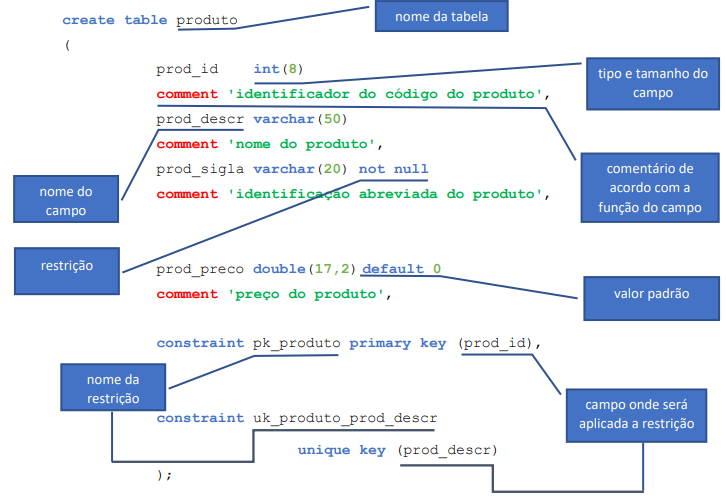

<h2>Estudando MySQL</h2>

Disciplina: Tecnologia da Informação II - ETEC

<h2>Agenda 02: Introdução ao SGBD, implementação de BDs e Interface de Comando.</h2>

## Relembrando...

`SGBD` consiste em um software utilizado para gerir Bases de Dados, permitindo criar, modificar, eliminar tabelas, além de inserir, alterar, excluir e consultar seus dados, tendo como principais características: garantir a segurança e integridade dos dados, seu compartilhamento e a recuperação de falhas (backup).

## Comandos:

### 1. Para criar um banco de dados, utilizar comandos "create database" ou "create schema":

Sintaxe:

~~~sql
create database <nome_do_banco_de_dados>; /* ou */
create schema <nome_do_banco_de_dados>;

/* Exemplo: */
create database escola;
~~~

### 2. Para criar tabelas:

Para criação de tabelas, utilizaremos DDL (Data Definition Language, ou Linguagem de Definição de Dados), que possui comandos para
definição e alteração de estruturas do banco de dados. 

Sintaxe:

~~~sql
create table nome_da_tabela (
campo_1 tipo(tamanho) [padrão] [restrição]
[comentário],
 .
 .
campo_n tipo(tamanho) [padrão] [restrição]
[comentário],
[constraint <nome_da_restrição> primary key (<campo(s)_da_tabela)>],
[constraint <nome_da_restrição> foreign key (<campo_da_tabela>)
references <tabela_de_origem> (<campo_origem>)],
[constraint <nome_da_restrição> unique key (<campo(s)_da_tabela)]);
~~~

Traduzindo:

<em>Composição da sintaxe da cláusula "create table".</em>

***Importante***: Não confundir "chave única" com "chave primária"; a chave única é utilizada quando necessitamos definir que um campo ou um conjunto de campos não podem ter seu conteúdo repetido, mas sem que ele ou eles sejam definidos como chave primária.

PÁGINA 4

[Voltar à página inicial!](https://github.com/monicaquintal/disciplina_TI_II_ETEC)