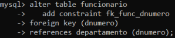

### 1. Para criar um banco de dados, utilizar comandos "create database" ou "create schema":

~~~sql
create database escola;
~~~

<em>Criando o BD.</em>

<em>Exibindo BDs existentes.</em>

### 2. Selecionando o banco de dados desejado:

~~~sql
use escola;
~~~

<em>Selecionando BD "escola".</em>

### 3. Para criar tabelas:

~~~sql
create table funcionario (
 fnumero int(10) unsigned auto_increment
comment 'identificador do funcionario',
 fnome varchar(80) not null
comment 'nome do funcionário',
endereco varchar(80) not null
comment 'endereço do funcionário',
 salario double(10,2) default 0
comment 'quantidade do produto em estoque',
  supernumero int(10)
comment 'identificador do funcionário supervisor',
  dnumero int(5) not null
comment 'identificador do departamento',
 constraint pk_funcionario primary key (fnumero)
);
~~~

<em>Criando a tabela de funcionarios.</em>

<em>Exibindo tabelas existentes no BD escola.</em>

e

~~~sql
create table departamento (
  dnumero int(5) auto_increment
    comment 'identificador do departamento',
  dnome varchar(50) not null
    comment 'nome do departamento',
  fnumero int(10) unsigned
    comment 'identificador do funcionário gerente',
  dataini date
    comment 'data de início do gerenciamento',
  constraint pk_departamento primary key (dnumero),
  constraint fk_depto_fnumero
    foreign key (fnumero)
    references funcionario (fnumero),
  constraint uk_dnome_depto
    unique key (dnome)
);
/*
  fnumero definida como chave estrangeira em "fnumero int(10) unsigned" e "foreign key (fnumero)"
  origem da chage estrangeira definida em "funcionario (fnumero)"
*/
~~~

<em>Criando a tabela de departamento.</em>

### 4. Obtendo mais detalhes sobre as tabelas criadas:

~~~sql
describe funcionario;
~~~

<em>Exibindo BDs existentes.</em>

e 
~~~sql
describe departamento;
~~~

### 5. Alterando uma tabela:

A) Adicionando o campo "email":

~~~sql
alter table funcionario
 add email varchar(80)
 comment 'e-mail do cliente';
~~~

<em>Alterando a tabela funcionário, incluindo o campo "email".</em>

B) Modificando a característica do campo email:

~~~sql
alter table funcionario
 modify email varchar(100);
~~~

<em>Alterando o campo "email", de varchar(80) para varchar(100).</em>

C) Excluindo um campo:

~~~sql
alter table funcionario
 drop email;
~~~

<em>Alterando a tabela funcionário, excluindo o campo "email".</em>

D) Incluindo restrição do tipo chave estrangeira:

~~~sql
alter table funcionario
 add constraint fk_func_dnumero
  foreign key (dnumero)
  references departamento (dnumero);
~~~

<em>Incluindo restrição de chave estrangeira.</em>

### 6. Excluindo uma tabela:

~~~sql
drop table funcionario;
~~~