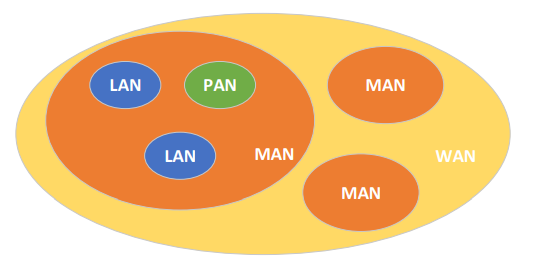

<h1>Estudando Redes de Computadores</h1>

Disciplina: Tecnologia da Informação II - ETEC

<h2>Agenda 06: Fundamentos da Rede de Computadores.</h2>

## Introdução

- redes foram desenvolvidas pela necessidade de transmitir dados a longas distâncias entre os computadores. 
- a Internet nasceu de um projeto chamado de `ARPANet` (Advanced Research Projects Agency Network) do departamento de defesa dos Estados Unidos que interligava as bases militares.

## Topologias de Rede

> A `Topologia de Redes` descreve como é estruturada uma rede de computadores, tanto física como logicamente.

- ***Topologia Física***: descreve como as redes estão conectadas fisicamente pelos cabos.
- ***Topologia Lógica***: descreve como os dados são transmitidos e trafegam pela rede (fluxo de dados entre os computadores que compõe a rede).

## Topologias Físicas de Rede

Há alguns tipos distintos de topologias físicas de rede de computadores, podendo apresentar diferentes classificações: Anel, Barramento, Estrela, Malha, Árvore e Híbrida. 

<em>Nesta agenda, foram estudadas as topologias Anel, Barramento e Estrela.</em>

### 1. `Topologia Anel` (ou token ring)

- é composta por uma rede interligada de computadores ou equipamentos de redes (chamados de nós) em forma de anel.
- este anel é composto por um conjunto de ligações ponto a ponto individuais que formam um círculo.
- a comunicação nesse tipo de topologia é controlada por um token (ou ficha) = token ring. 
  - o token controla quem pode transmitir a informação na rede. 
  - a ficha fica circulando na rede e o computador que deseja transmitir a informação captura o token e inicia a  transmissão de dados > os dados circulam pelo anel até o destinatário > os dados continuam a circular pelo anel, até que o emissor os retire > quando o transmissor acabar o envio de informações, ele libera o token na rede para outro nó poder executar a comunicação. 
- ***importante***:
  - conforme o número de estações aumenta, o congestionamento para a transmissão de dados também cresce, uma vez
que somente um nó pode transmitir por vez. 
  - cada computador deve ter 2 placas de rede para fazer a comunicação.
  - caso haja um problema nos cabos que ligam o anel ou em uma estação (ou algum tupo de ruptura de conexão), a rede pode parar de funcionar.

### 2. `Topologia de Barramento` (ou em barra)

- todos os computadores são ligados fisicamente a um mesmo cabo. 
- somente um computador pode realizar a transmissão de dados, sem que haja colisão. 
- se o cabo que compõe a barra falhar, a rede para de funcionar!
- os cabos utilizados nessa topologia são: coaxiais 10Base2 e 10Base5.

### 3. `Topologia Estrela`

- os nós de rede são conectados a um dispositivo concentrador chamado ***switch***, que faz a tarefa de recepção dos dados, para o posterior envio destes para o destinatário.
- há duas opções:
  - switch: sabe todas as máquinas que estão conectadas a ele (ip).
  - hub: não sabe quais são (ou se há) computadores conectados, encaminhando para todas as máquinas o mesmo pacote.
- ***vantagens***: 
  - o switch encaminha o dado somente para o computador de destino e não para toda a rede como nas duas topologias anteriores. Logo, a rede funciona de modo muito mais eficiente. 
  - caso haja um problema em um dos cabos, somente a estação cujo cabo houve problema é prejudicada, enquanto a rede continua funcionando normalmente.

### Comparando:

Topologia / Características | Estrela | Anel | Barramento
-----------------------------|--------|-------|------------
Simplicidade funcional | Melhor | Razoável | Razoável (melhor que o anel)
Roteamento | Inexistente | Inexistente no anel unidirecionado, simples nos outros tipos | Inexistente
Custo de conexão | Alto | Baixo para médio | Baixo
Crescimento incremental | Limitado à capacidade do nó central | Teoricamente infinito | Alto
Aplicação adequada | Aquelas envolvendo processamento | Sem limitação | Sem limitação
Desempenho | Baixo, todas as mensagens precisam passar pelo nó central | Alto, possibilidade de mais de uma mensagem ser transmitida ao mesmo tempo | Médio
Confiabilidade | Pouca | Boa, desde que sejam tomados cuidados adicionais | A melhor de todas; interface passiva com o meio
Retardo de transmissão | Médio | Baixo, podendo chegar a não mais do que 1 bit por nó | O mais baixo de todos
Limitação quanto ao meio de transmissão | Nenhuma, ligação ponto-a-ponto | Nenhuma, ligação ponto-a-ponto | Devido à ligação multiponto, sua ligação ao meio de transmissão pode ser de custo elevado

## Classificação de Redes de Computadores

As redes de computadores podem também ser classificadas conforme a sua extensão geográfica.

### Classificações:

1. ***PAN***:

- Personal Area Network ou rede de área pessoal.
- é uma rede de computadores doméstica que interliga computadores pessoais, impressoras, dispositivos móveis, etc.
- possui alcance limitado, geralmente em metros.
- pode utilizar equipamentos de rede comuns.
- pouca possibilidade de expansão.
- exemplos: Interligação entre dispositivos móveis como computadores, smartphones, tablets etc.

2. ***LAN***:

- Local Area Network ou redes de área local. 
- é a mais conhecida e permite interligar computadores, servidores e outros equipamentos de rede numa área geográfica limitada.
- operam em velocidades entre 10Mbps e 1Gbps.
- exemplos: Interligação de equipamentos de um escritório, escola, empresa, prédio ou conjunto de prédios. 

3. ***MAN***:

- Metropolitan Area Network ou rede de área metropolitana.
- interconecta diversos negócios.
- ode ter um tamanho de dezenas de quilômetros.
- em geral, as conexões de uma MAN são feitas por cabos de fibra óptica. 
- exemplo: pode interligar uma rede de lojas em uma região metropolitana. Um exemplo de MAN são as empresas de
TV a cabo.

4. ***WAN***:

- Wide Area Network ou rede de longa distância. 
- utilizadas para a interconexão de redes menores como LANs e MANs. 
- podem se estender desde cidades inteiras, passando por estados, países, até continentes. 
- um exemplo de WAN é a Internet.

 
<em>Classificação de Redes de Computadores.</em>

## Meios de Transmissão

PÁGINA 09