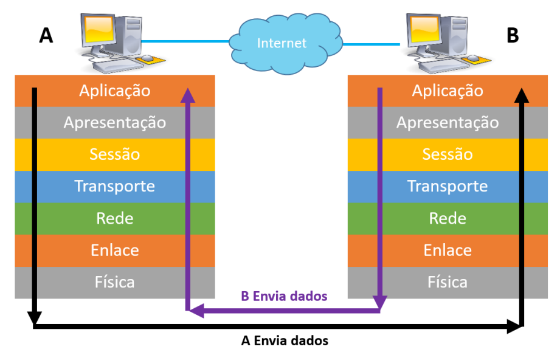
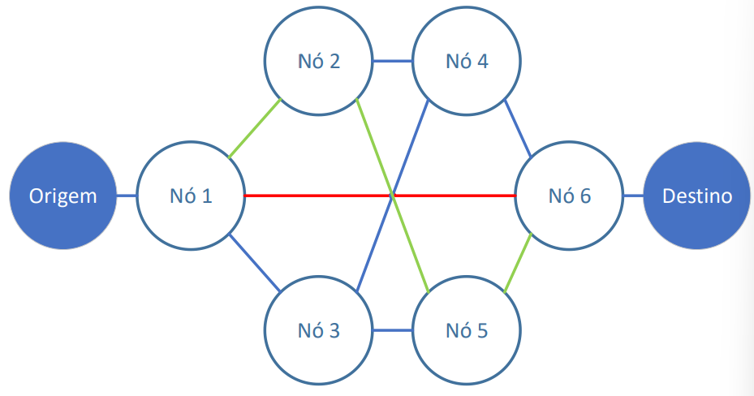
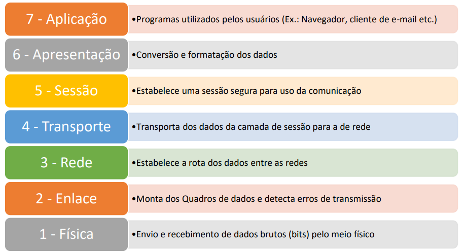
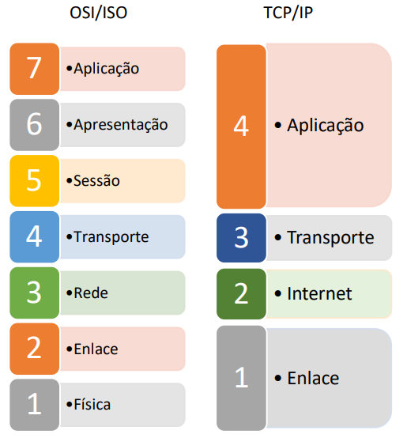

<h1>Estudando Redes de Computadores</h1>

Disciplina: Tecnologia da Informação II - ETEC

<h2>Agenda 07: Modelos de Referência.</h2>

## Introdução

Nem todas as máquinas são iguais e, para que haja comunicação entre os diferentes tipos de computadores, há necessidade de um tipo de intérprete, que chamamos de `Protocolo`.

O protocolo serve para realizar a comunicação entre os mais variados tipos de computadores e dispositivos sem perda de mensagem.
Se você possui um sistema Linux e deseja mandar um arquivo para um computador Windows, você manda por meio de algum protocolo e o outro sistema conseguirá identificar o arquivo. Obviamente você não vai a um menu e escolher o protocolo, é automático.

Nos tempos mais remotos das redes, quando ainda se começavam a desenvolver os protocolos, não eram seguidos padrões que possibilitassem a interligação entre redes de diferentes arquiteturas (falta de padronização dos componentes; cada fabricante produzia seu hardware e software, que muitas vezes não era compatível com os dos demais fabricantes).

Para solucionar esse problema, foi criado o `modelo OSI` (Open System Interconnection), a fim de padronizar a comunicação entre hardware e software. Esse modelo foi definido pela ISO (International Standards Organization), e foi arquitetado e segmentado em camadas que representam as etapas para que a comunicação ocorra.

## Modelo OSI/ISO

- criado em 1971 e formalizado em 1983.
- composto por sete camadas.
  - 7 - aplicação.
  - 6 - apresentação.
  - 5 - sessão.
  - 4 - transporte.
  - 3 - rede.
  - 2 - enlace.
  - 1 - física.
- ***objetivo***: interconectar sistemas abertos a comunicação com outros sistemas. 
- “O modelo OSI em si não é uma arquitetura de rede, pois não especifica os serviços e os protocolos que devem ser usados em cada camada. Ele apenas informa o que cada camada deve fazer”.

 
<em>Modelo OSI/ISO e suas sete camadas.</em>

> No modelo OSI/ISO, quando dois dispositivos se comunicam, cada uma das camadas do remetente comunicam-se somente com as camadas correspondentes do receptor, devido ao processo de encapsulamento (com o qual, ao transmitirmos um pacote do computador A para o computador B, cada camada do modelo vai acrescentando cabeçalhos para que as camadas inferiores não precisem trabalhar com as informações das camadas superiores, já encapsuladas/empacotadas). E quando o pacote chega ao computador B esses dados vão sendo desemcapsulados (desempacotados).

Portanto, quando enviamos um dado do computador A, a camada de Aplicação encapsula os dados colocando identificadores e cabeçalhos antes de passar para a camada de Apresentação. A camada de Apresentação faz o mesmo antes de enviar os dados para a camada de Sessão e assim sucessivamente até chegar à camada física onde os dados são transmitidos. 

Chegando ao receptor, o computador B, na camada de Enlace, por exemplo, desencapsula os dados correspondentes a essa camada e os repassa para a camada de Rede, continuando o processo até chegar à camada de Aplicação. Assim, cada camada funciona de maneira independente das outras.

## Camada Física

- ***envolve o hardware e o meio de transmissão*** usados na comunicação de dados.
- define ***qual tipo de meio físico será feita a transmissão de dados*** (fibra ótica, cabo de cobre, sem fio/wireless).
- ***quanto ao hardware***, é definido:
  - se a comunicação será bidirecional ou unidirecional.
  - nível de tensão para representação de um bit 0 e um bit 1.
  - quantidade de tempo (duração) que cada bit leva para ser transmitido.
  - handshake para início e fim das comunicações físicas (processo de início do estabelecimento de uma comunicação, em que são definidos os protocolos de comunicação e a velocidade de transmissão de dados).
  - layout e tamanho dos conectores de rede (incluindo n°. de pinos).
- é a ***camada mais baixa*** do modelo OSI/ISO, na qual há a ***transmissão bruta dos bits*** no canal de comunicação.

## Camada de Enlace

- também chamada de enlace de dados ou link de dados. 
- ***transforma os dados brutos (trem de bits) recebidos pela camada física em um quadro ou frames de dados***, permitindo o acesso de camadas superiores ao meio físico.
- um quadro é montado a partir de padrão especial de bits no início e no fim do quadro que são reconhecidos pela camada de enlace. 
- é nessa camada que os ***erros de transmissão/recepção são tratados***.
- é a ***responsável pelo endereço físico do equipamento***, conhecido como `MAC address`.
- exemplos de equipamentos que trabalham na camada 2 do modelo OSI/ISO: hub e switch não gerenciável.

> O `MAC address` (Media Access Control) é um endereço de 48 bits representado em numeração hexadecimal, e tem que ser único na rede para não haver conflito de endereços.

## Camada de Rede

- uma das mais importantes no modelo OSI. 
- ***responsável por estabelecer o caminho/rota que os dados percorrerão desde a sua origem até o seu destino final***.
  - ***rotas podem ser estáticas ou dinâmicas***. 
  - rotas estáticas sempre seguirão pelo mesmo percurso, independentemente do que aconteça.
  - rotas dinâmicas podem ser alteradas conforme a necessidade (caso o tráfego de dados em uma determinada conexão esteja muito alto e causando congestionamentos na rede, por exemplo).

 
<em>Exemplo de rotas de comunicação (Camada de Rede).</em>

- a camada de rede ***também pode realizar a “tradução” de protocolos de rede*** para que estas se comuniquem.
  - os protocolos mais comuns são: IP, IPX e Apple Talk.
- ao contrário da camada de Enlace que utiliza endereços físicos (MAC), a ***camada de rede utiliza endereços lógicos, como o endereço de IP***.
- roteadores e os switches gerenciáveis l3 atuam na camada de rede.

## Camada de Transporte

- a camada de transporte ***pode segmentar os dados na origem para enviar os dados pelo meio de comunicação e reagrupá-los no destinatário, entregando-os para a aplicação correta.***
- é na camada de transporte que a função de ***QoS (Quality of Service)*** é fornecida.
- os dois protocolos mais comuns da pilha TCP/IP presentes nessa camada são TCP e o UDP.
  - `Protocolo TCP (Transmission Control Protocol)`:
    - é um protocolo do modelo TCP/IP orientado para conexão. 
    - permite que os seguimentos de comunicação sejam entregues de forma ordenada, confiável e com controle de fluxo. 
    - exemplos de aplicações que utilizam esse protocolo são clientes de e-mail, FTP e browsers.
  - `Protocolo UDP (User Datagram Protocol)`:
    - é mais simples que o TCP.
    - também pertencente ao modelo TCP/IP.
    - não é orientado para a conexão e não fornece controle de erros.
    - exemplos de aplicações são Streaming de vídeo e chamadas VoIP.
- é ***responsável pelo endereçamento (número) das portas dependendo da aplicação***.

Lista de postas mais utilizadas:
Porta (n°.) | Serviço
-----------|-----------
20 | FTP 
23 | Telnet
25 | SMTP
53 | DNS
63 | Whois
80 | HTTP
110 | POP3
119 | NNTP
161 | SNMP
194 | IRC
443 | HTTPS
993 | IMAPS

## Camada de Sessão

- ***responsável por estabelecer seções entre eles, controlando o diálogo entre as aplicações nos sistemas local e remoto***. 
- uma sessão é uma comunicação entre hosts, permitindo a transferência de dados de forma segura, como utilizando login e senha.

## Camada de Apresentação

- ***responsável por estabelecer a comunicação de duas redes com protocolos distintos***, fazendo com que uma rede TCP/IP comunique-se com outra IPX/SPX, por meio da tradução dos dados. 
- ***faz também a conversão de formatos de dados diferentes*** como por exemplo o ASCII e o Unicode.
- o gateway (“ponte”) que traduz protocolos atua na camada de apresentação.

## Camada de Aplicação

- é a ***camada mais visível para os usuários***. 
- trabalhamos com ela diariamente quando utilizamos programas como clientes de e-mail, mensagens instantâneas, navegadores, entre outros.
- trabalha com diversos protocolos como:
  - DHCP – Dynamic Host Configuration Protocol - responsável pela distribuição de endereços de IP automaticamente.
  - HTTP – HyperText Transfer Protocol – para páginas da internet (web).
  - DNS – Domain Name System – responsável por traduzir nomes para endereços de IP e vice-versa.
  - FTP – File Transfer Protocol – responsável por permitir a transferência de arquivos. 

 
<em>Resumo das Camadas do modelo OSI/ISO.</em>

## Modelo TCP/IP

- surgiu devido a uma necessidade do departamento de defesa americano (DoD), que com a ameaça da guerra fria teve receio de ter suas instalações destruídas, suas comunicações interrompidas e seus dados perdidos.
- é um modelo, também arquitetado e estrutural, que propôs resolver o problema da falta de dinâmica da comunicação entre essas instalações.
- pode ser considerado o avô da internet como conhecemos hoje.
- foi desenvolvido no final da década de 1960 e ínício de 70, pelo DoD, para realizar a comunicação entre as unidades militares.
- surgiu de um projeto experimental chamado ***ARPANET*** (Advanced Research Project Agency Network) que valia-se de links de comunicação de alta velocidade utilizando comutação por pacotes.
- em 1972, o uso da ARPANET começou a crescer internacionalmente e se tornou a Internet como conhecemos hoje.

> `IP (Internet Protocol)` é o protocolo de Internet que é responsável pelo endereçamento de dispositivos nas redes para que os dados consigam chegar ao seu destino, conforme o endereço de IP do destinatário.

- o modelo TCP/IP possui 4 camadas (Enlace, Internet, Transporte e Aplicação).

 
<em>Comparativo do Modelo OSI/ISO com o TCP/IP.</em>

PÁGINA 10