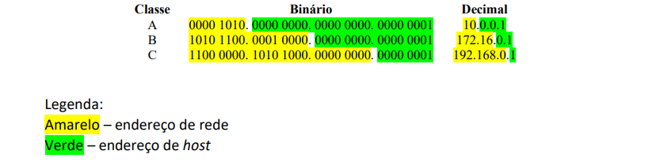
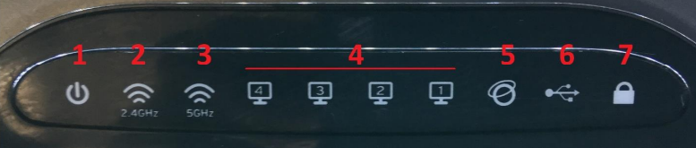

<h1>Estudando Redes de Computadores</h1>

Disciplina: Tecnologia da Informação II - ETEC

<h2>Agenda 08: Internet e Protocolos - Endereçamento de Redes.</h2>

## Introdução

### Wi-fi:
- abreviação de “Wireless Fidelity” (fidelidade sem fio).
- é uma tecnologia de comunicação que não faz uso de cabos.
- geralmente é transmitida através de frequências de rádio, infravermelhos etc.

### IP (Protocolo da Internet):
- composto por um conjunto de números. 
- permite a comunicação entre computadores por meio do endereço IP.
- para organizar a distribuição de IPs, foram reservados alguns números para as redes locais e na internet, e essa responsabilidade é da Internet ***Assigned Numbers Authority*** (Autoridade Atribuidora de Números para Internet). 
- dois computadores não podem ter o mesmo IP. 
- finalizada a conexão, esse IP poderá ser atribuído a outro computador.

## Endereçamento de Redes

### Na arquitetura TCP/IP...
- cada computador é endereçado utilizando-se um endereço IP.
- tanto o computador quanto a rede devem ter endereços únicos.

## Como funciona o endereço IP versão 4 (IPv4)?

### Sobre o endereço IP:
- é um endereço lógico que funciona com 32bits (4 bytes) de comprimento, divididos de 8 em 8 (1 byte), ou octetos. 
- esses octetos geram uma representação em números decimais de 0 a 255;
- 1 octeto = 8bits, logo para representação em decimal temos 28 = 256 endereços.

### Protocolos IPv4 E IPv6:
- protocolo IPv4 possui um número de endereços limitado que já se esgotou. 
- para resolver o problema, foi desenvolvido o protocolo IPv6, que utiliza 128bits.
- a transição já está em curso.
- como o IPv4 ainda é amplamente utilizado, é nele que focaremos nossos estudos.

### Exemplo de um endereço de IP:

&#32; | Endereço IP
------|:-------------:
Binário | 0000 1010.0000 0000.0000 0000.0110 0100
Decimal | 10.0.0.100

Portanto, é mais simples representar um endereço IP em decimal que em binário; porém, para realizar os cálculos para determinar os endereços de rede e broadcast deve-se utilizar a notação binária.

## Endereço e Classes de IP

- o endereço IP possui uma hierarquia composta por `endereço de rede`, de `sub-rede` e de `host` (computadores). 
- a parte do endereço de rede é utilizada pelos roteadores de rede para encaminhar os dados com os pacotes IP até a rede de destino.
- no exemplo da tabela, o número 10 corresponde ao endereço de rede e os números 0.0.100 ao endereço de host.

### Classes de IP

- o endereçamento IP está dividido em 5 classes. 
- a classe do IP determina o número de Bytes que são utilizados para representar o endereço de rede e o de hosts. 
- para determinar a classe de um endereço de IP, analisar os 4 primeiros bits do primeiro octeto dos 32 existentes.

Classe | Regra | Exemplo
------|---------|--------
A | Primeiro bit é 0 | 0000 1010. 0000 0000. 0000 0000. 0000 0001 = 10.0.0.1
B | Primeiros dois bits são 10 | 1010 1100. 0001 0000. 0000 0000. 0000 0001 = 172.16.0.1
C | Primeiros três bits são 110 | 1100 0000. 1010 1000. 0000 0000. 0000 0001 = 192.168.0.1
D | Primeiros quatro bits são 1110 | 1110 0000. 1111 1111. 0000 0000. 0000 1010 = 224.255.0.10
E | Primeiros quatro bits são 1111 | 1111 0000. 1010 1010. 0101 0101. 0000 1111 = 240.170.85.15

Considerando um número de IP com a seguinte notação X.Y.Z.W, onde:

- 1º octeto = X
- 2º octeto = Y
- 3º octeto = Z
- 4º octeto = W

Com base na regra apresentada na tabela anterior, podemos chegar à seguinte conclusão:

Classe | Faixa de endereços (X) | Indicador de rede | Indicador de host | Nº de redes disponíveis | Nº de hosts disponíveis
-------|-------------------------|------------------|-------------------|-------------------------|----------------------
A | 0 a 127 | X (7 bits) | Y.Z.W (24 bits) | 126 | 16.777.214
B | 128 a 191 | X.Y (14 bits) | Z.W (16 bits) | 16.384 | 65.534
C | 192 a 223 | X.Y.Z (21bits) | W (8bits) | 2.097.152 | 254
D | 224 a 239 | - | - | - | -
E | 240 a 255 | - | - | - | -

***Observações:*** 
- classes D e E não podem ser utilizadas sendo reservadas. A classe D é reservada para multicast (envio de dados específico para um grupo) e a classe E para pesquisa e desenvolvimento.
- na coluna Indicador de rede:
  - Classe A o primeiro bit sempre vai ser zero, logo 8 bits – 1 =7.
  - Classe B os dois primeiros bits serão 10, logo 16 – 2 = 14.
  - Classe C os três primeiros bits serão 110, logo 24 – 3 = 21.

 

<strong>Dados os endereços de IP 30.56.120.240 e 200.123.6.8 você sabe identificar a
classe de cada um deles?</strong>

- pegar o primeiro octeto e converter para um valor binário. 
- no caso do número 30.56.120.240: 
  - o primeiro octeto é o número 30, então 30 (decimal) = 0001 1110 (binário).
  - analisando o primeiro bit à esquerda que é zero, determinamos que o IP pertence à **classe A** de endereços.
- segundo número 200.123.6.8:
  -  convertendo 200 para binário, temos 11001000.
  - como os três primeiros bits são um, um e zero (110) temos um **IP classe C**.

## Redes Classe A

- utiliza o primeiro octeto para o endereçamento de rede e os três restantes para o endereçamento de host.
- logo, o formato de um número de IP X.Y.Z.W, X corresponde ao endereço de rede e Y.Z.W ao endereço de host.
- a classe A permite somente 126 redes com 16.777.214 hosts. 
  - devido ao grande número de hosts na rede, podemos subdividi-los em sub-redes para poder gerenciar esta rede. 
  - um número elevado de hosts em uma única rede pode levar a alguns problemas como, por exemplo, colisões dentro dessa rede ou um grande
número simultâneo de broadcasts de mensagens, congestionando-a.

> Um `Broadcast` é um tipo de transmissão especial de dados cujo pacote transmitido é recebido por todos os hosts da rede.

- a divisão em sub-redes é feita por meio da utilização de máscaras de sub-redes. 
  - apesar do conceito de classes de IP já definir qual parte do endereço de IP é um endereço de rede e qual é de host, a máscara de sub-rede confirma quantos bits (dos 32) serão utilizados para identificar a rede e quantos para identificar host. 
- podemos dividir uma rede com elevado número de hosts em redes menores (sub-redes), ***facilitando a manutenção, solução de problemas e aumentando o seu desempenho***.
- a máscara de sub-rede determina que o endereço de rede é representado pelo bit 1 e o endereço de host é representado pelo bit 0.

### Exemplo:

IP 20.1.0.30, com uma máscara de sub-rede 255.0.0.0.

- convertendo a máscara de sub-rede para binário:
  - decimal: 255.0.0.0 
  - binário: 1111 1111. 0000 0000. 0000 0000. 0000 0000
- para o IP 20.1.0.30, o primeiro octeto (20) representa rede e os três últimos (1.0.30) endereços representa hosts, de acordo com a máscara de sub-rede utilizada (255.0.0.0).
- logo, o endereço da rede é 20.0.0.0:
  - IP: 20.1.0.30.
  - Binário: `0001 0100`. 0000 0001. 0000 0000. 0001 1110.
  - Decimal: `20`.1.0.30.

- a máscara de sub-rede padrão para um endereço de IP classe A é 255.0.0.0.
  - assim, os oito primeiros bits (primeiro octeto) representam o endereço de rede e os 24 restantes o endereço de host. 
- em um endereço de IP classe A, para criar uma sub-rede podemos ***utilizar o segundo octeto***. 
  - os dois primeiros octetos representam o endereço de rede e os dois últimos o endereço de host. 
  - como o segundo octeto passa a representar o endereço de rede, a máscara de sub-rede será 255.255.0.0, uma vez que para representar o endereço de rede, os bits têm que obrigatoriamente ser 1.
- considerando a rede 20, podem ser criadas as sub-redes de 20.1, 20.2,20.3 até 20.255:

Rede 20.0.0.0 | hosts
--------------| -------------------------
Sub-rede 20.1 | 20.1.0.1, 20.1.0.2, 20.1.0.3, 20.1.0.4, 20.1.0.5
Sub-rede 20.2 | 20.2.0.1, 20.2.0.2, 20.2.0.3, 20.2.0.4, 20.2.0.5
Sub-rede 20.3 | 20.3.0.1, 20.3.0.2, 20.3.0.3, 20.3.0.4, 20.3.0.5
Sub-rede 20.230 | 20.230.0.1, 20.230.0.2, 20.230.0.3, 20.230.0.4, 20.230.0.5

### Você no comando

Quantos endereços de host estão disponíveis em cada sub-rede de um IP 20.1.0.1 com uma máscara de sub-rede 255.255.0.0?

- 2¹⁶ - 2 = 65534.
- como chegamos a esse número? 
  - basta observar a máscara de sub-rede: a máscara é ***255.255.0.0***. 
  - como o número 255 decimal é igual a 1111 1111 em binário, convertendo temos: 1111 1111. 1111 1111. 0000 0000.0000 0000.
  - na máscara de sub-rede o bit 1 representa o endereço de rede e o bit 0 endereço de host; como temos 16 bits 0 (zero) representando os hosts, o número de hosts é 2¹⁶ - 2 = 65534.
  - o primeiro endereço no caso do exemplo 20.1.0.0 é o endereço da rede e não pode ser utilizado. E o último 20.1.255.255 é o endereço de broadcast da rede, e também não pode ser utilizado. Por esse motivo, subtrair duas unidades do cálculo.

## Redes Classe B

- Uma rede classe B utiliza os dois primeiros octetos para o endereçamento de rede e os dois restantes para o endereçamento de host.
- Logo, em um número de IP X.Y.Z.W, X.Y corresponde ao endereço de rede e Z.W ao endereço de host.
- Uma rede classe B permite 16.384 redes com 65534 hosts cada.
- A máscara de sub-rede padrão para um endereço de IP classe B é 255.255.0.0.

Exemplo: considere o IP 140.105.0.76, com uma máscara de sub-rede 255.255.0.0.

- convertendo a máscara de sub-rede para binário:

decimal | binário
---------|------------
255.255.0.0 | 1111 1111. 1111 1111. 0000 0000. 0000 0000

- no IP 140.105.0.76, os primeiros dois octetos (140.105) representam a rede e os dois últimos (0.76) endereços de hosts, de acordo com a máscara de sub-rede padrão utilizada (255.255.0.0). Logo, o endereço da rede é 140.105.0.0
- os 16 primeiros bits (primeiro e segundo octetos) representam o endereço de rede e os 16 restantes o endereço de host. Nesse exemplo, como foi usada uma máscara padrão nenhuma sub-rede foi criada.

- Em um endereço de IP classe B, para criar uma sub-rede utilizamos o terceiro octeto.
- Assim, os três primeiros octetos representam o endereço de rede e o último o endereço de host. 
- Como o terceiro octeto passa a representar o endereço de rede, a máscara de sub-rede será 255.255.255.0, uma vez que para representar o endereço de rede os bits têm que obrigatoriamente ser 1.

## Redes de Classe C

- Uma rede classe C utiliza os três primeiros octetos para o endereçamento de rede e último para o endereçamento de host, dessa forma temos, o formato de um número de IP X.Y.Z.W, X.Y.Z corresponde ao endereço de rede e W ao endereço de host.
- Uma rede classe C permite 2.097.152 redes com 254 hosts cada.
- A máscara de sub-rede padrão para um endereço de IP classe C é 255.255.255.0.
- Os 24 primeiros bits (primeiro, segundo e terceiro octetos) representam o endereço de rede e os oito restantes o endereço de host.
- Em um endereço de IP classe C, é possível criar uma sub-rede utilizando o quarto octeto. 

## Endereços Reservados

### Uso especial:

- Endereços de 127.0.0.0 a 127.255.255.255 são reservados para a comunicação com o computador local ou localhost e para teste de loopback.

### Redes Provadas (Internas):

- Classe A: 10.0.0.0 a 10.255.255.255 com máscara de sub-rede 255.0.0.0 (8bits)
- Classe B: 172.16.0.0 a 172.31.255.255 com máscara de sub-rede 255.240.0.0 (12bits)
- Classe C: 192.168.0.0 a 192.168.255.255 com máscara de sub-rede 255.255.0.0 (16bits)

Para isso, faz-se necessária a reserva de endereços de redes privadas pois estes endereços não são usados na internet e, portanto, os roteadores não encaminham os pacotes contendo como destinatários endereços privados, isto é, esses endereços são válidos somente em redes locais de empresas e residências.

## Configuração de uma rede local com Wi-Fi

Para realizar a configuração da rede necessitaremos de:

- Roteador sem fio.
- Cabo(s) de rede.
- Computador(es).

O roteador utilizado neste exemplo é um roteador com três antenas destacáveis, dual band (opera tanto em redes Wi-Fi de 2,4 e 5GHz) e com uma porta USB para a ligação de impressoras ou HDs externos.

## 1. Identificando o dispositivo:

 
<em>Leds indicadores de estado superiores.</em>

1. Indicador de Ligado/desligado.
2. Rede sem fio de 2,4GHZ ativa.
3. Rede sem fio de 5,0GHz ativa.
4. Computadores ligados à porta LAN (1-4).
5. Conexão de Internet ativa.
6. Impressora ou dispositivo de Armazenamento conectado à porta USB.
7. Indicador de conexão WPS.
    - WPS (Wi-Fi Protected Setup): permite que os usuários conectem dispositivos à rede sem fio sem utilizar as senhas. 
    - É aconselhável deixar a função desabilitada para evitar a invasão de redes sem fio por terceiros não autorizados.

 
<em>Painel traseiro.</em>

1. Fonte de alimentação
2. Botão liga/desliga
3. Botão de reset
4. Porta USB
5. Porta de conexão com a internet pela Ethernet ou modem DSL
6. Portas de conexão LAN para computadores locais
7. Botão WPS para conexão rápida de dispositivos de rede sem fio.

## 2. Conectando e ligando o roteador:

- conectar a fonte de alimentação no conector número 1.
- ligar o cabo de rede proveniente do modem ou da rede Ethernet na porta número 5 (azul).
- ligar cabo de rede que vai para o computador em qualquer uma das quatro portas identificadas pelo número 6 (amarelo).
- ligar o roteador pelo botão liga/desliga.
-  informações como endereço de rede do roteador (IP), usuário e senha para login, em geral, estão impressas em uma etiqueta na parte inferior do roteador. Caso não estejam, consultar o manual.
- assim que o dispositivo ligar, para efetuar o teste, abrir o prompt de comando (CMD) e digitar: ping numeroIP para ver se o roteador está corretamente conectado.
  - se retornar uma mensagem escrita “Host de destino inacessível” verificar as ligações entre os equipamentos.
  - o `comando ping` testa se a conexão com o host ou servidor de destino está funcionando corretamente. A sintaxe é: ping &lt;endereço ip ou endereço na internet&gt;. Exemplo: ping www.cps.sp.gov.br ou ping 10.0.0.1.

## 3. Configurando o roteador:

- Com o roteador conectado, abra o navegador e digite o endereço IP.
- Insira o nome de usuário e senha constantes na etiqueta/manual do dispositivo.
- Retornará uma tela com as configurações do roteador.

### 4. Configuração da Rede Sem Fio

### 5. Configurações de segurança

---

## Exercitando

1. Quantas classes de IP existem? Como identificamos cada uma delas?

Existem 5 classes de endereços IP: A, B, C, D e E.
Para identificar cada uma delas devemos analisar os primeiros bits do primeiro octeto:
- Classe A: o primeiro bit é zero. (0).
- Classe B: os dois primeiros bits são um e zero (10).
- Classe C: os três primeiros bits são um, um e zero (110).
- Classe D: os quatro primeiros bits são um, um, um e zero (1110).
- Classe E: os quatro primeiros bits são um, um, um e um (1111).

2. Qual é a máscara de sub-rede padrão das classes A, B e C?

As máscaras de sub rede padrão são:
- Classe A: 255.0.0.0
- Classe B: 255.255.0.0
- Classe C: 255.255.255.0

3. Dado o endereço de IP 10.2.40.1. 
a) Qual é a classe de IP? 
b) Qual é a máscara de sub-rede padrão? 
c) Qual(is) octeto(s) representa(m) o endereço de rede? 

Para o endereço de IP 10.2.40.1: 
a) é um endereço de IP Classe A, pois convertendo para binário temos: 

Decimal | Binário
--------|----------
10.2.40.1 | 0000 1010. 0000 0010. 0010 1000. 0000 0001

b) a máscara de sub-rede padrão é 255.0.0.0. 
c) 
Decimal | Binário
--------|-----------
10.2.40.1 0000 1010. 0000 0010. 0010 1000. 0000 0001

4. O que é broadcast?

Um Broadcast é um tipo de transmissão especial de dados cujo pacote transmitido é recebido por todos os hosts da rede.

5. Quais são as faixas de endereços de IP reservados para redes internas?

 Os endereços de IP reservados para redes internas são:
- Classe A: 10.0.0.0 a 10.255.255.255 com máscara de sub-rede 255.0.0.0 (8bits).
- Classe B: 172.16.0.0 a 172.31.255.255 com máscara de sub-rede 255.240.0.0 (12bits).
- Classe C: 192.168.0.0 a 192.168.255.255 com máscara de sub-rede 255.255.0.0 (16bits).

6. O que é WPS? É seguro deixá-lo habilitado?

WPS é um método para facilitar a conexão de dispositivos wireless (sem fio) sem necessidade de inserirmos a senha da rede sem fio. Não é seguro deixar essa função habilitada, já que possui brechas de segurança que permitem a invasão da rede sem fio.

---

## Atividade

### Cidade Inteligente

<em>"Cidade inteligente (smart city) é um conceito que agrega tecnologias para o acesso democrático do cidadão à Internet, em particular na utilização de serviços públicos de governo eletrônico, permitindo que tais cidadãos participem de forma ativa e colaborativa da municipalidade existente. 

Tecnologias e serviços, assim como provas de conceitos, para cidades inteligentes precisam ser desenvolvidas para atender peculiaridades de comunidades específicas. Cidades inteligentes incluem tópicos como acesso metropolitano e sem fio à Internet de banda larga, serviços interativos e colaborativos privados, públicos e governamentais, segurança e privacidade do cidadão e Internet das coisas (Internet of things). 

Leia o texto apresentado no componente de Inglês: "Smart Cities: Vision"  https://smartcities.media.mit.edu/ 

 

Vamos a atividade! 

Suponha uma empresa que possua e mantenha uma infraestrutura de acesso à Internet sem fio e com fio em várias cidades do Brasil. Essas infraestruturas podem variar de cidade para cidade em termos de velocidade e capilaridade (cobertura). 

Você e a sua equipe foram contratados por essa empresa para propor um projeto de cidade inteligente a ser implantado nessa infraestrutura de rede. Vocês têm total liberdade para propor projetos para a utilização de toda essa infraestrutura em pelo menos um dos tópicos mencionados no quadro da equipe. 

Os projetos propostos deverão ser sustentados por argumentações que demonstrem de que modo a infraestrutura será utilizada para atingir os objetivos do projeto. 

Apresente junto com sua equipe, através da ferramenta Microsoft Whiteboard uma proposta. 

ATENÇÃO! 
Seu professor tutor enviou através do Correio TEC uma mensagem com o título "Atividade Cidade Inteligente", nesta mensagem contém todas as informações para acesso a ferramenta Microsoft Whiteboard e instruções para a elaboração da proposta. 

IMPORTANTE: Mesmo sendo divididos em equipes, a avaliação será individual, de acordo com sua contribuição na proposta do projeto.</em>

### [Resposta aqui.](./atividade_whiteboard_Grupo01.png)

--- 

[Voltar à página inicial!](https://github.com/monicaquintal/disciplina_TI_II_ETEC)